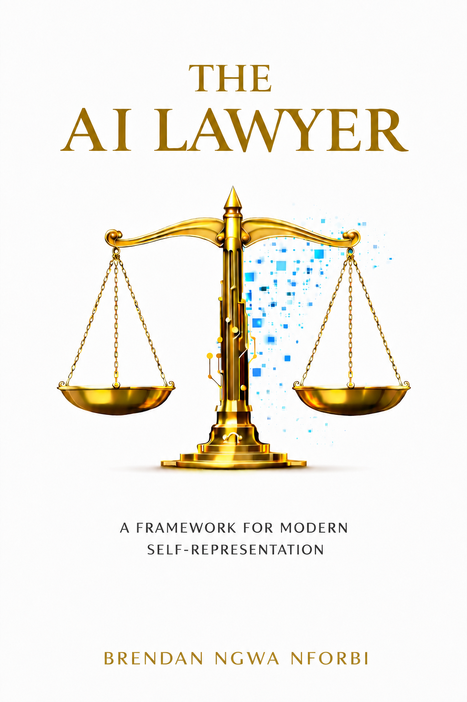

# The AI Lawyer



**AI-Powered Civil Rights Litigation for the Self-Represented**, by Brendan Ngwa Nforbi.

A nonfiction guide for pro se (self-represented) civil litigants on using a
multi-model AI workflow — research, drafting, discovery, depositions,
settlement — to build and run a case without a licensed attorney. The author
is not an attorney; the book says so repeatedly and by design.

<br clear="right">

## What the book is about

The Prelude sets up the book's operating premise in one line: **"A lawsuit
is a machine."** Facts are inputs, law is logic, procedure is code, remedy
is output — and once you can see a case as a structured system rather than
an impenetrable mystery reserved for people who went to law school, an AI
that can hold the entire system in working memory becomes a genuine
equalizer. The book exists because that equalizer only recently became
real: Chapter 1 opens on the access-to-justice crisis it's answering —
the Legal Services Corporation's finding that low-income Americans receive
inadequate or no help for roughly 92 percent of their civil legal problems,
and a private attorney running $300-plus an hour that can put even a
straightforward case out of reach for $25,000–$75,000 before trial ever
starts. Courts are required to read pro se filings generously (*Haines v.
Kerner*, 1972) — but that protection only helps once a litigant has found
the right legal theory in the first place, which is exactly the gap the
book is trying to close.

Twenty chapters across six parts carry a reader from that starting point to
a filed, litigated case:

| Part | Chapters | Covers |
|---|---|---|
| I — The New Paradigm of Self-Representation | 1–2 | Why the system is broken, and the AI toolkit built to work around it |
| II — The Multi-Model Synthesis Method | 3–7 | Turning raw facts into a court-ready draft: intake, a "Round-Robin" where every model competes to find the strongest legal theories, synthesis, iterative feedback, and CM/ECF-compliant formatting |
| III — Navigating the Litigation Arena | 8–11 | The full case lifecycle, opposing-counsel communication, surviving a motion to dismiss, and the defense's standard procedural playbook |
| IV — The Money Phase: Mastering Discovery | 12–14 | Building interrogatories/RFPs/RFAs/subpoenas, using AI to triage thousand-page document productions, and simulating depositions against an AI opponent before the real one |
| V — Strategy, Settlement, and Sanity | 15–17 | Settlement dynamics, AI-assisted case valuation and demand letters, and protecting your mental health through the delays |
| VI — Real-World Execution | 18–20 | A live, unresolved case study; nine ethical guardrails for responsible AI use; and a closing chapter on what to do when the system still says no |

Two appendices back the methodology with reference material: the complete
prompt library used throughout the book, organized by chapter, and a
plain-English glossary of litigation vocabulary.

## Why it's different from a typical legal self-help book

- **It's built around a live, unresolved lawsuit, not a hypothetical.**
  Chapter 18 walks through a real Section 1983 case — filed in federal
  court and still being litigated as this book goes to print — from the
  roadside incident through the motion to dismiss and the pro se
  opposition, with identifying details altered but the factual pattern,
  legal theories, and AI-assisted responses presented as they actually
  happened. Most legal how-to books use sanitized hypotheticals; this one
  puts its own methodology on the line in a case whose outcome the author
  doesn't yet know.
- **Multi-model by design, not single-chatbot by convenience.** The core
  method — the "Round-Robin Research Explosion" (Ch.4) and the "Thoughts?"
  five-version iteration loop (Ch.6) — deliberately runs the same legal
  question through several AI models and treats disagreement between them
  as signal, not noise. The book argues a single model's confident wrong
  answer is a bigger risk in litigation than the extra time it takes to
  make several models compete.
- **It takes AI's failure modes as seriously as its capabilities.**
  Chapter 19 is nine guardrails for responsible use — hallucinated
  citations, over-reliance on AI judgment, and the limits of what a
  non-lawyer with a chatbot can safely do — treated as a chapter in its
  own right, not a disclaimer buried in the front matter (though the front
  matter has real disclaimers too).
- **It's a reference tool as much as a read-through.** The Appendix A
  prompt library and the chapter-end Key Takeaways sections are built for
  a reader mid-case flipping back to a specific chapter under deadline
  pressure, not only a reader going cover to cover.
- **Narrow by design.** The methodology could be described in the
  abstract as generalizable to any self-represented civil case, but the
  book doesn't pretend that. The tactical chapters (Parts III–V) are built
  specifically around Section 1983, qualified immunity, and government
  defendants, because that's the fact pattern the author knows and where
  the access-to-justice gap is most acute — not a general-purpose
  litigation manual wearing a civil-rights cover.

## Repo structure

```
manuscript/    The editable source of truth (.docx). Every fix, section,
               and layout change is made here first.
exports/       Generated deliverables (PDF, EPUB), rendered from the
               manuscript. Never edited directly — always regenerated.
cover-art/     Front and back cover art (PNG originals, JPG front cover
               for platforms that require it).
```

## Regenerating the exports

The PDF and EPUB are both produced from `manuscript/The_AI_Lawyer_D2D_Ready.docx`
via LibreOffice headless conversion:

```
soffice --headless --convert-to pdf  --outdir exports manuscript/The_AI_Lawyer_D2D_Ready.docx
soffice --headless --convert-to epub --outdir exports manuscript/The_AI_Lawyer_D2D_Ready.docx
```

The EPUB needs one additional pass after conversion: LibreOffice's exporter
doesn't embed the custom fonts (EB Garamond, Montserrat, IBM Plex Mono) or
fully satisfy the EPUB 3.2 spec on its own. Before shipping an EPUB, it must
be post-processed to:
1. Strip the `direction: ltr` CSS rule LibreOffice adds (disallowed in EPUB stylesheets)
2. Add a `<title>` element to any XHTML file missing one
3. Bundle the actual font files and add `@font-face` declarations + manifest entries

Validate with `epubcheck` before publishing — it should report 0 errors / 0 warnings.

## Production notes

This edition went through a full editorial and production pass:
- Structural fix: promoted 143+ run-in subheadings from plain text to real
  heading styles, enabling working tables of contents/navigation in every format
- Added chapter-end Key Takeaways to all 20 chapters, a Sources & Further
  Reading section (citations independently verified, not just recalled), an
  About the Author section, and a closing review request
- Corrected epigraph misattributions, embedded file metadata, and
  straight-quote/number-style inconsistencies
- Full typography redesign: EB Garamond (body) / Montserrat (headings) /
  IBM Plex Mono (prompt/template blocks), with a gold/navy two-color
  hierarchy sampled directly from the cover art
- Removed hardcoded AI model version numbers (e.g. specific point releases)
  throughout, since those go stale fast — model/product names are kept,
  version numbers are not
- Merged the author's own content revision (tightened subtitle and scope,
  rewritten Key Takeaways, updated bio) back into the designed manuscript
  after it round-tripped through Google Docs, which strips fonts, sizes,
  colors, and section dividers down to plain-text defaults. The merge
  restored the full typography system — title/chapter/heading hierarchy,
  epigraphs, bulleted lists, monospace template blocks, and all 217 section
  dividers — paragraph by paragraph, verified against the original text so
  only formatting was reapplied, nothing was reworded in the process

## Distribution status

| Channel | Status |
|---|---|
| Amazon KDP (Kindle) | Submitted, in review |
| Draft2Digital (Apple Books, Kobo, B&N, Everand, library services, etc.) | Submitted, pending payment/tax verification |
| Direct sale (Gumroad/Payhip) | Not yet started |
| Print (KDP Print / IngramSpark) | Deferred — needs a wraparound cover with spine width calculated from final page count |

No ISBN has been purchased. Ebook distribution uses each platform's free
ISBN/ASIN; a self-owned ISBN would only be needed if/when print distribution
expands beyond Amazon (IngramSpark requires a supplied ISBN; KDP Print does not).

## Cost-benefit vs. a freelance/Fiverr-style production process

This entire production pass — full editorial review, structural rewrites,
new chapter content grounded in the existing text, citation verification,
a typography redesign, EPUB spec compliance and font embedding, cover
touch-ups, and live platform submission support — was done in a single
continuous AI-assisted session rather than commissioned piecemeal from
freelancers. Worth being honest about where that helped and where it didn't:

**Where it likely beat a freelance/Fiverr route:**
- **Speed and cost.** Comparable scope — editor, typesetter, ebook
  formatter, and some design/image work — realistically runs
  $1,500–3,000+ across multiple freelancers over 1–3 weeks, with revision
  rounds adding lag each time. This happened in one session.
- **Verification rigor.** Every edit was diffed against the prior version,
  the EPUB was validated against the actual spec (`epubcheck`), citations
  were checked against real sources rather than trusted from memory, and
  pages were rendered and visually inspected rather than assumed correct.
- **Continuity.** Full context of the entire ~300-page book and every
  prior decision was available throughout — no re-briefing a new
  collaborator partway through, no lost context between revision rounds.

**Where a good freelancer would likely beat this:**
- **Editorial taste.** A skilled human editor brings lived judgment about
  voice, pacing, and "this doesn't land yet" that pattern-matching against
  convention only approximates.
- **Original design.** Cover art here was cleaned up (barcode/ISBN and a
  decorative graphic removed), not designed from scratch by an illustrator
  working from a brief.
- **Domain accountability.** A litigator-editor reviewing the legal
  strategy content directly would catch substantive issues that citation
  verification alone doesn't cover, and carries professional accountability
  that an AI collaborator does not.

**Net take:** strong for speed, cost, and mechanical rigor across a large
surface area; a human professional pass — especially a legal-practice read
on the substantive advice — is still a reasonable step before betting fully
on this at wide print scale.
